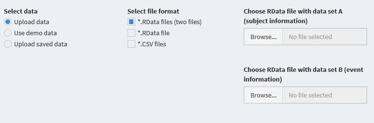
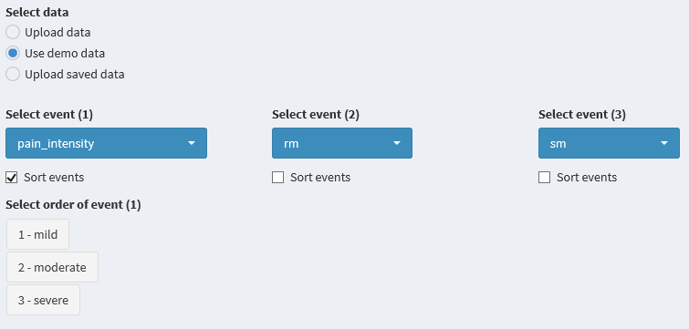
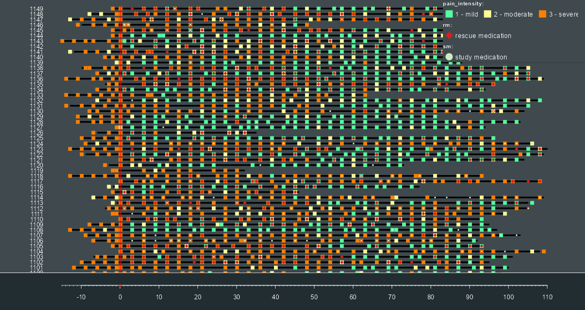
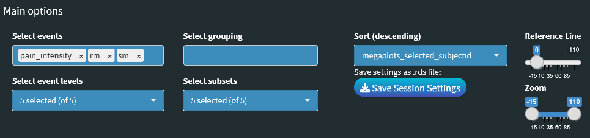

        

<!-- badges: start -->

<!-- badges: end -->

## Description

A 'megaplot' is a 'shiny' application and as the name suggests,
is a huge graphical display showing individual-level data over time
interactively. In the context of clinical trials, megaplots seek to
represent longitudinal data while focusing on event visualization 
for each subject throughout the entire course of the trial. 
It also implements artificial intelligence techniques to produce
a 'smart' plot, thus enabling the user to detect interesting patterns
in the data across the entire population or within specified subgroups.
With this, one can get a deeper insight into the data in ways that
are not possible with traditional static data visualizations.

## Getting Started

The package megaplots is available on 'github' and may be installed using

install_github("Bayer-Group/BIC-Megaplots")

respectively.

After installation megaplots can be started using

library("megaplots")

launch_megaplots()

The application will start showing the data upload page. For detailed information on how to upload data see section [Functionality](#Functionality).

## Functionality

Once the 'megaplots' package is installed, simply call this 
application through the function launch_megaplots(). 
Next, upload the subject-defining and event-defining 
datasets through the 'Data Import'-panel. 

For more information on the required 
data structure see [Input Data](#Input Data). below. If it
is of interest to sort the graphical display according to the order
of events, it is possible to select 'Sort events' and further
'Select order of event' in the same 'Data import' tab. 

Once you hit 'Submit', it takes you to 
the 'Megaplot' panel which is the actual graphical display of 
all events for all subjects, with the horizontal axis showing 
the time frame and the vertical axis showing the subject identifiers. 
The horizontal lines against the subject IDs show when and which 
event has occurred, including the event level and multiple events
on the same day.

The 'Main options' panel on the top helps navigate 
this plot interactively, e.g., selecting/deselecting events and their
levels according to the user's interest; selecting grouping and
sorting variables (e.g., by subject ID, by default). Grouping
and/or sorting help in detecting patterns among subjects and events.
There is also a reference line that by default is set at 
'time zero' and may be changed as needed. 

Finally, the Zoom feature helps to zoom in any portion of the plot to read it in 
greater detail. 

The next panel is for 'Displayed subjects' which
is a feature to select subsets of patients, either deterministically
or randomly, for display in the plot. 

The app also offers sequencing of variables for sorting through the 'Sequencing' 
panel, respectively. 

The 'Settings' panel has several options for display, including thickness of subject 
lines, color theme etc.

The color palette to depict different
events/different levels of the same event is available through
the 'Color Options' panel. 

Additionally, the raw data as well as 
summary statistics (e.g. number of events for each subject) for
the data displayed in the plot may be accessed through the 
corresponding panels.    

        

## Input Data

Two datasets are to be created: The subject-defining dataset (A) 
contains one record per subject. The event defining dataset (B)
has one record for each relative day per subject on which the
subject experienced at least one of the prespecified events.
Both datasets have mandatory variables with prescribed format as described below:

 A: subjectid, start_time, end_time
 
 B: subjectid, event_time.
 
Missing values in mandatory variables are not allowed.
The relative day event_time in dataset B can be based on any date 
at the beginning of the individual study course (e.g., screening 
date, randomization date, or first drug intake). There is no 
prespecified order for variables in the datasets. The app supports two
file formats of data to build a new megaplot ('Upload data'):
  Comma separated values (CSV) file 
  RData file            
The input datasets A and B  CSV or RData file for input must
include a data frame with the following variables and formats:

Subject-defining dataset (A):

|Column                     |Class      | Example                              |
|:--------------------------|:----------|:-------------------------------------|
| subjectid*                | integer   | ---                                  | 
| start_time*               | integer   | -18 (i.e. 18d in screening)          | 
| end_time*                 | integer   | 291 (i.e. 291d  after 1st dose)      | 
| baseline characteristics  | character | treatment, age group, sex, region,...| 
| baseline characteristics  | numeric   | age, number of days with pain, ...   | 

*mandatory variable (name can differ)

Event defining dataset (B):

|Column                 | Class     | Example                              |
|:----------------------|:----------|:-------------------------------------|
| subjectid*            | integer   |                                      | 
| event_time*           | integer   | Relative day                         | 
| event 1               | character | Pain = MILD                          | 
| event 2               | character | Biopsy = YES                         | 
| event 3               | character | Treatment = ACTIVE                   | 
| event 4               | character |                                      | 

*mandatory variable (name can differ)

Besides baseline characteristics for grouping and sorting, 
you can also add post-baseline characteristics in dataset A. 
For instance, the number of days with severe pain could serve as 
sorting variable, or, if classified (<1 day, 2-3 days, >=4 day),
you can use it for grouping.
       
Note for RData input file: 
All grouping factors (A) and event-outcomes (B) need to be
in character ('chr') format.  
There are two options for uploading RData files:
Two separate RData files containing data frame A and B, respectively, can be uploaded.
One RData file which is a list object with elements A and B, can be uploaded.
Furthermore, an upload of an existing megaplot with all settings is
possible within the main options ('Use saved app settings'). This requires that a 
previously created megaplot has been saved as an rds-file via
'Save Session Settings' (navigation pane 'Main option'). 

## Additional information
The display of the observation time (x-axis) is limited. If the maximum number of days is high - then check if the event symbols are still displayed correctly. If not - reduce the maximum (via zoom-in) or decrease the number of displayed events and/or event-levels. 

To use the full screen size for your megaplot: 

a) Press 'F11' before pressing Submit button in Data Import,

b) Hide both navigation panes, if not used.

You can save a megaplot with all the settings, via Save Session 
Settings (navigation pane 'Main option'). If it does not work
change your browser or try uploading the settings repeatedly.

The number of events displayed in a megaplot is limited to 4. If dataset B contains more events - the app takes the first 4 events automatically. These can be manually changed under Data import (left navigation pane), before pressing the Submit button. 

For a detailed look use the Open/Close Zoom Panel (navigation pane 'Main option') to provide Zoom-in screenshot. The magnifier (Windows) can help, too. If the megaplot remains empty after uploading your data - make sure that all values are checked under Select event levels (navigation pane 'Main option').
