README
================

- [Description](#description)
- [Getting Started](#getting-started)
- [File Upload & Variable Selection](#file-upload--variable-selection)
- [Event & Color Selection](#event--color-selection)
  - [Event / Event Group Tree](#event--event-group-tree)
  - [Event / Event Group Color List](#event--event-group-color-list)
  - [Color Selection Panel](#color-selection-panel)
  - [Color Methods](#color-methods)
  - [Jitter Events](#jitter-events)
  - [Save & Upload Color Files](#save--upload-color-files)
- [Megaplots](#megaplots)
  - [General Display](#general-display)
  - [Plot Options (modebar)](#plot-options-modebar)
  - [Scrolling](#scrolling)
  - [Legend](#legend)
- [Event Summary](#event-summary)
  - [Displays](#displays)
- [Sidebar Options](#sidebar-options)
  - [Sorting / Grouping](#sorting--grouping)
  - [Plot Appearance](#plot-appearance)
  - [Filter](#filter)
  - [HTML Download](#html-download)
- [README](#readme)
- [Input Data](#input-data)
- [Additional information](#additional-information)

<!-- badges: start -->

<!-- badges: end -->

## Description

A ‘megaplot’ is a ‘shiny’ application and as the name suggests, is a
huge graphical display showing individual-level data over time
interactively. In the context of clinical trials, megaplots seek to
represent longitudinal data while focusing on event visualization for
each subject throughout the entire course of the trial.

The concept of the megaplots app has been redesigned at the end of 2025.
If you want to use the previous version, please use Release version
v.1.1.10.

## Getting Started

The package megaplots is available on ‘github’ and may be installed
using

install_github(“Bayer-Group/BIC-Megaplots”)

respectively.

After installation megaplots can be started using

library(“megaplots”)

run_app()

The application will start showing the data upload page. For detailed
information on how to upload data see next section.

## File Upload & Variable Selection

Once the ‘megaplots’ package is installed, simply call this application
through the function run_app(). Next, upload the dataset through the
‘File upload’-panel.

Please click on the “Browse…” button and upload the desired data set.
Currently, it is only possible to use .RData as data format. If other
formats are used, an error message appears.

After successful upload, options for the variable selection will appear.

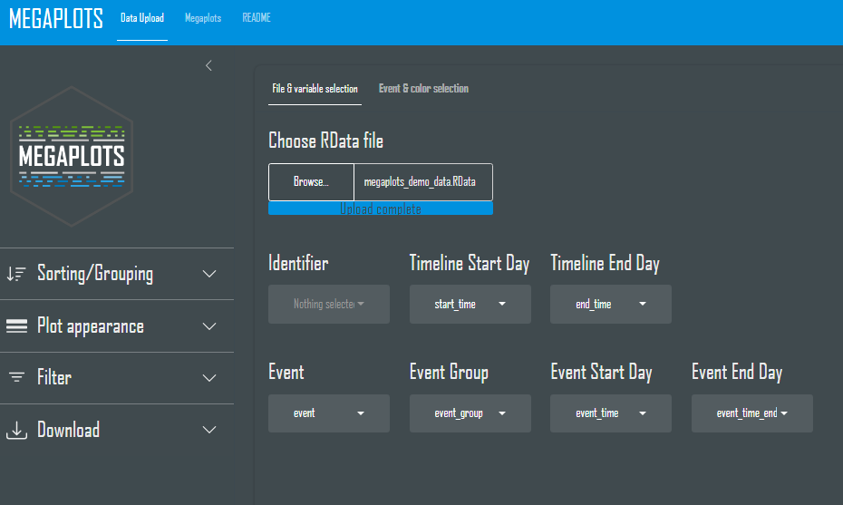

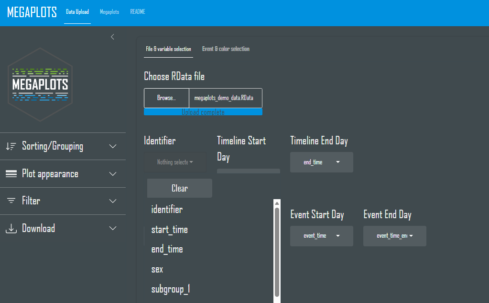

The variable “Identifier” is used as subject identifier and can be a
numeric or character variable. The variables “start_time” & “end_time”
define the start and end time of a subject ongoing in the study.

For more detailed information about the data structure see [Input
Data](#Input%20Data). below.

## Event & Color Selection

Explanatory text for this chapter will follow soon.

### Event / Event Group Tree

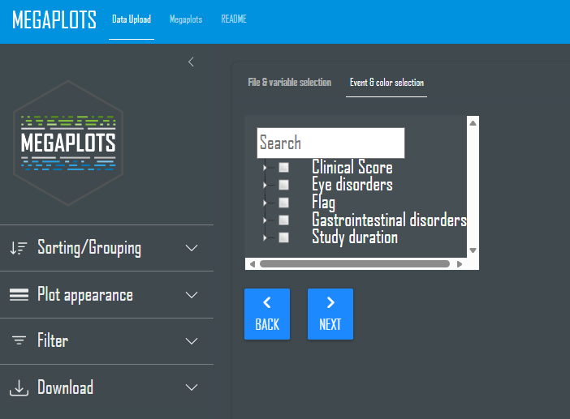

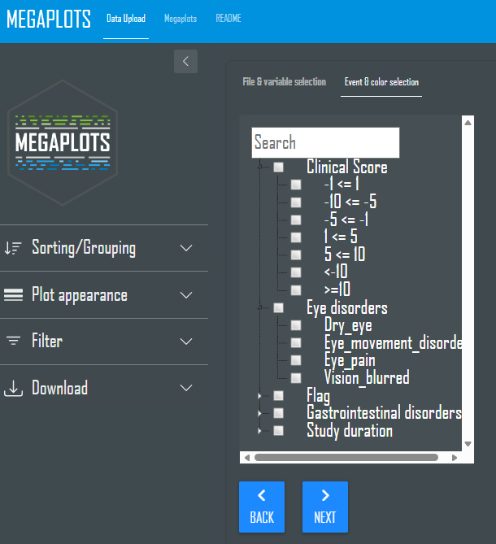

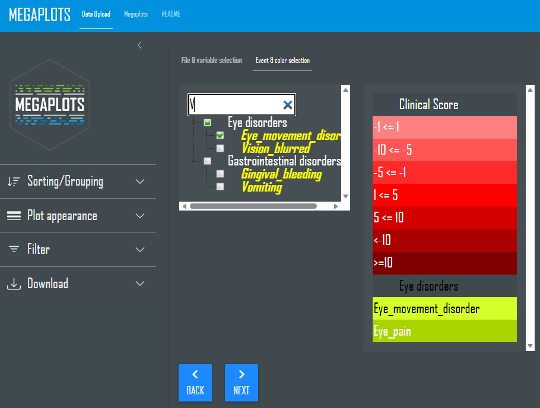

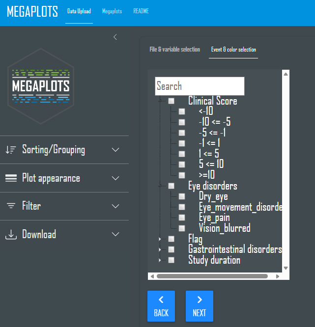

Explanatory text for this chapter will follow soon.

### Event / Event Group Color List

### Color Selection Panel

Explanatory text for this chapter will follow soon.

### Color Methods

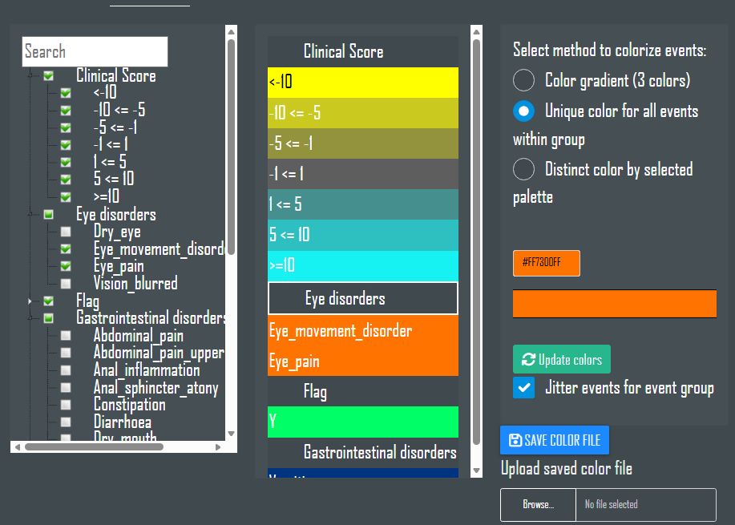

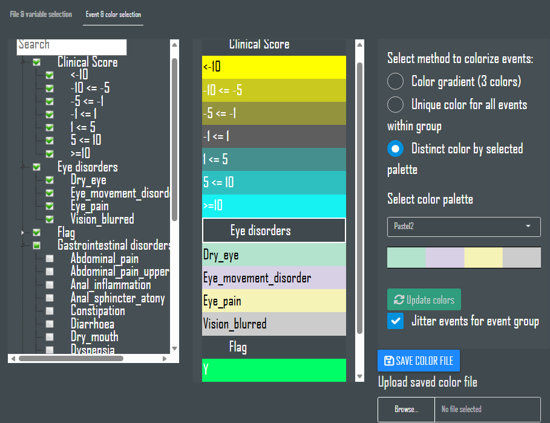

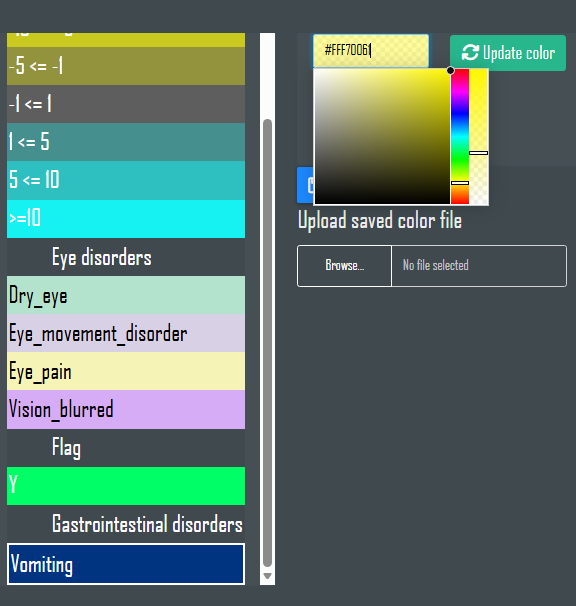

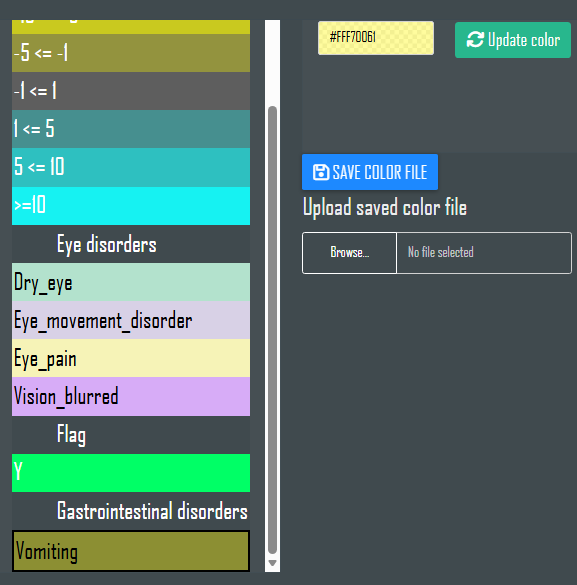

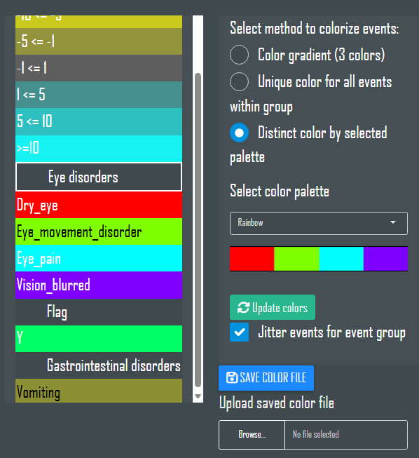

Explanatory text for this chapter will follow soon.

### Jitter Events

Explanatory text for this chapter will follow soon.

### Save & Upload Color Files

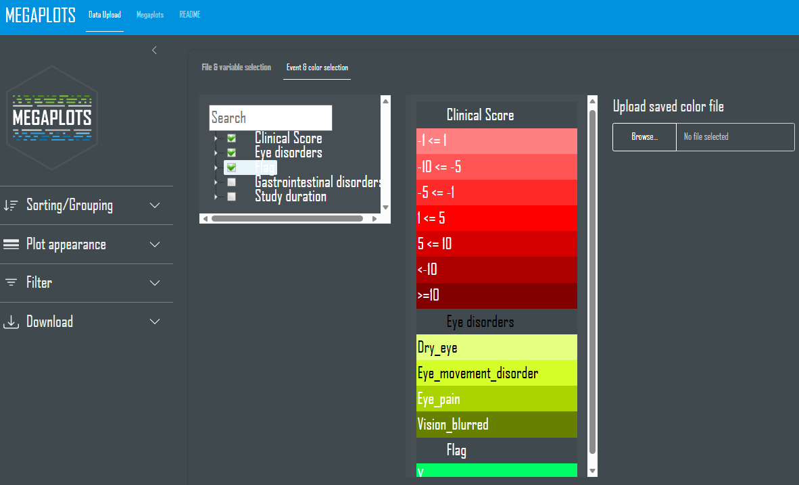

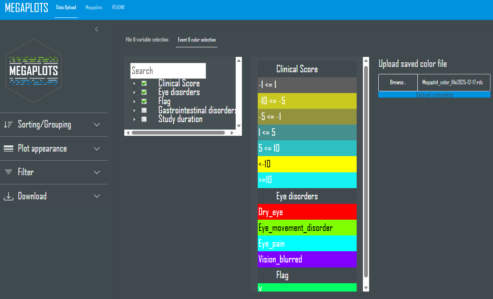

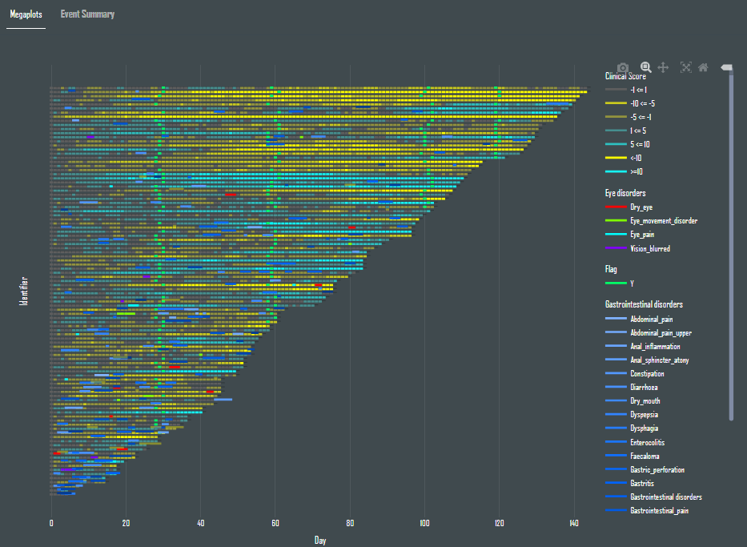

Explanatory text for this chapter will follow soon.

## Megaplots

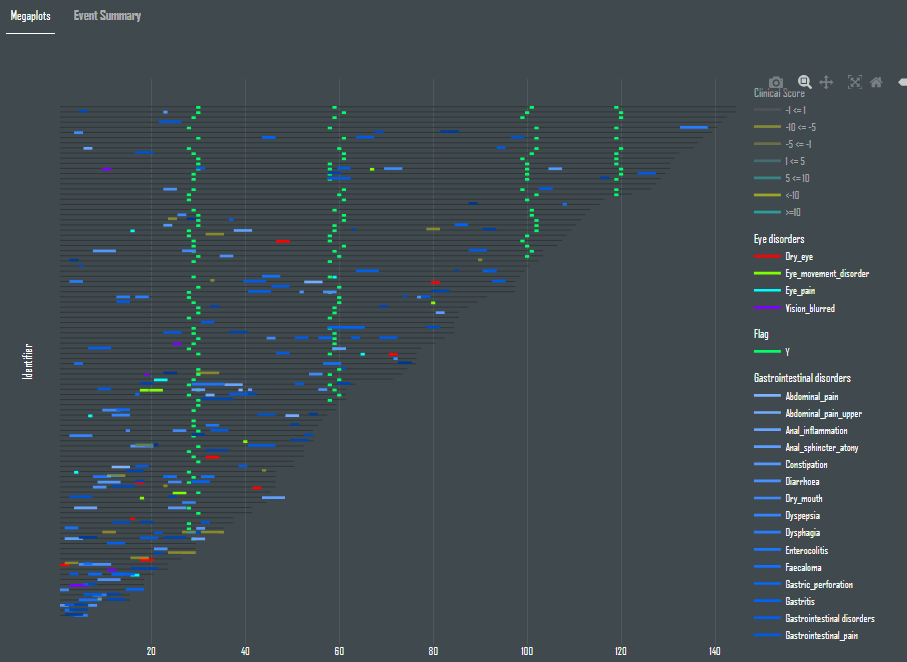

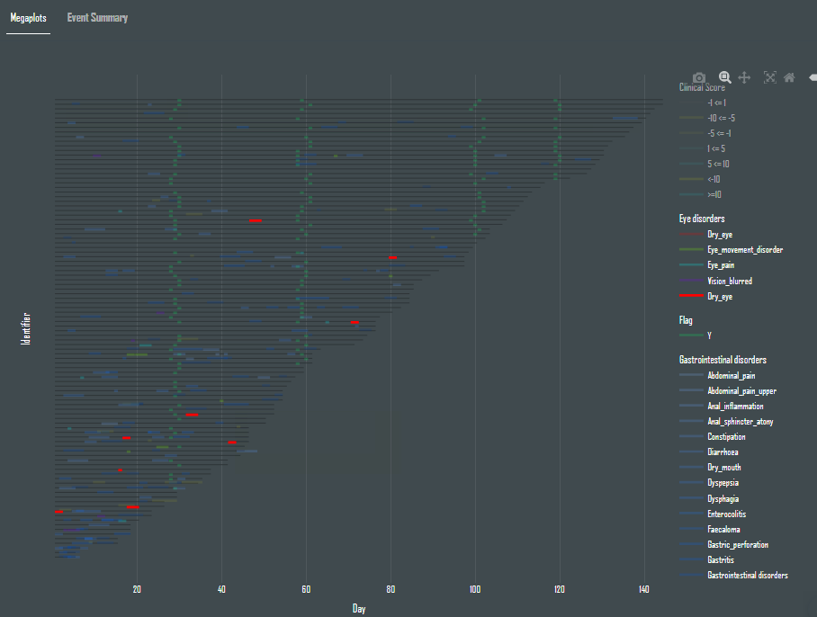

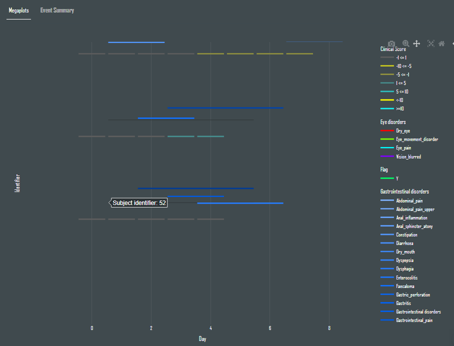

Explanatory text for this chapter will follow soon.

### General Display

Explanatory text for this chapter will follow soon.

### Plot Options (modebar)

Explanatory text for this chapter will follow soon.

### Scrolling

Explanatory text for this chapter will follow soon.

### Legend

Explanatory text for this chapter will follow soon.

## Event Summary

Explanatory text for this chapter will follow soon.

### Displays

Explanatory text for this chapter will follow soon.

## Sidebar Options

Explanatory text for this chapter will follow soon.

### Sorting / Grouping

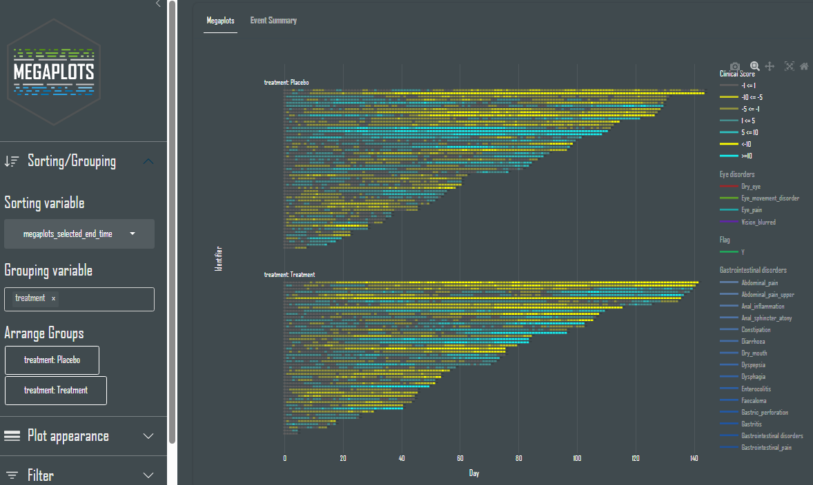

Explanatory text for this chapter will follow soon.

### Plot Appearance

Explanatory text for this chapter will follow soon.

### Filter

Explanatory text for this chapter will follow soon.

### HTML Download

Explanatory text for this chapter will follow soon.

## README

Explanatory text for this chapter will follow soon.

## Input Data

| Column | Class | Note |
|:---|:---|:---|
| subjectid \* | numeric/character |  |
| start_time \*\* | integer (numeric) | numeric variables are rounded down to integer |
| end_time\*\* | integer (numeric) | numeric variables are rounded down to integer |
| event\* | character (numeric) | numeric variables are transformed to character |
| event_group | character (numeric) | if no selection is made, event is also used for event group |
| event_time \*\* | integer (numeric) | numeric variables are rounded down to integer |
| event_time_end \*\* | integer (numeric) | numeric variables are rounded down to integer |

\* mandatory variable (name can differ)

\*\* one of the variable pairs start/end_time or event_time/\_end is
mandatory (names can differ)

Besides these variables any variables can be added for grouping and
sorting. All numeric variables will be applicable for sorting and all
character variables for grouping. For more information about “Sorting /
Grouping” please refer to chapter “Sidebar options”.

## Additional information

To use the full screen size for your megaplot hide sidebar, if not used.
