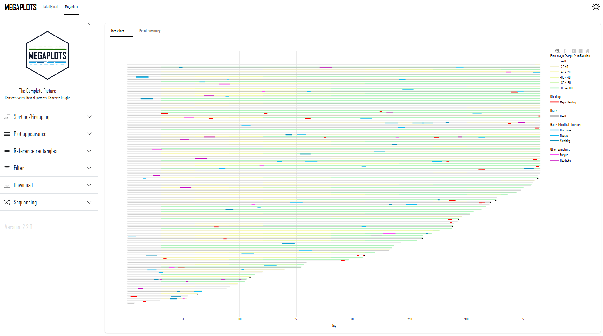

<!-- README.md is generated from README.Rmd. Please edit that file. -->

# Megaplots <br> <u style= 'font-size: 20px;'>The Complete Picture</u> <br> <em style= 'font-size: 18px;'> Connect events. Reveal patterns. Generate Insights.</em>

## Overview

**Megaplots** is an R package that provides an interactive
[Shiny](https://shiny.posit.co/) application for visualizing
individual-level longitudinal data in clinical trials.

A *megaplot* provides a large-scale graphical display in which every
subject’s event history is rendered on a single canvas, making it
straightforward to identify patterns, outliers, and safety signals
across the full course of a study.

The package is aimed at data scientists and statisticians to explore
subject-level events and measurements across the full duration of a
trial. It is designed to support exploratory data analysis and safety
review in early and late-phase studies.

## Key Features

- **Subject-level timelines** — one row per subject, spanning the entire
  observation period, with events rendered as colour-coded bars.
- **Interactive controls** — filter by treatment arm, study visit, event
  type, or any variable in the dataset via a reactive sidebar.
- **Multi-domain overlays** — overlay adverse events, lab abnormalities,
  and concomitant medications on the same timeline for each subject.
- **Sorting and grouping** — Cohort-level organisation controls.
- **Event-driven seriation** — sequence subjects along the y-axis by the
  timing of a user-selected anchor event, revealing temporal patterns
  and relationships that fixed ordering would obscure.
- **Themeable** — customise colour palettes and lane ordering to match
  your organisation’s style guide.

## Demo

The main panel displays a **subject-level timeline plot** in which each
row corresponds to a single trial participant. Events are rendered as
colour-coded markers along a continuous time axis — typically study day
allowing the reviewer to scan the full cohort at a glance and
immediately spot clusters of adverse events, early discontinuations, or
dose modifications.

The **sidebar** on the left provides reactive sorting functionalities,
grouping and filter controls: select one or more treatment arms,
restrict the view to a specific study visit window, or drill down to
individual subjects by identifier. Several options making it
straightforward to compare subgroups or isolate a subject of interest
during a safety review meeting. With the numerous options, its easier
than ever to customize the plot appearance.


## Installation

Megaplots is not yet on CRAN. You can install the development version
from [GitHub](https://github.com/Bayer-Group/BIC-megaplots) with either
of the following:

``` r
# install.packages("remotes")
remotes::install_github("Bayer-Group/BIC-megaplots")
```

``` r
# install.packages("pak")
pak::pak("Bayer-Group/BIC-megaplots")
```

## Usage

``` r
library(Megaplots)
```

The app opens in your default browser.

## Main Functions

| Function    | Description                              |
|-------------|------------------------------------------|
| `run_app()` | Launches the Megaplots Shiny application |

## Documentation

Detailed documentation can be found in the Tutorial document in this
repository and included within the app.

## Contributing

Contributions of all kinds are welcome — bug reports, feature requests,
and pull requests. Please read CONTRIBUTING before getting started, and
note that this project is released with a Contributor Code of Conduct.
By participating you agree to abide by its terms.

To report a bug or request a feature, please open an issue.

## License

Megaplots is licensed under the GNU General Public License v3.0 (GPL-3).
